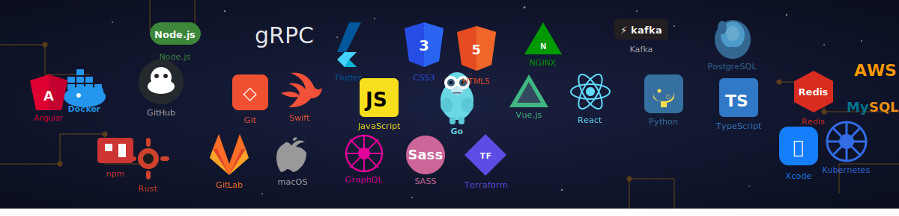

<h1 align="center">
  
</h1>

  

---  
  <h3>B.Tech AI & Data Science | Full-Stack Web Developer | Freelancer</h3>
  
  
🚀 <b>Expertise:</b> Building commercial web applications and AI-driven solutions.

  
🛠️ <b>Proven Track Record:</b> Successfully delivered full-stack projects for independent clients.

  
🎓 <b>Research:</b> Former Research Engineer Intern in Data Science & Machine Learning.

---

### 👨‍💻 About Me

* 🏡 **From:** Alwar, India
* 🎓 **Education:** B.Tech in AI & Data Science (Completed 6th Sem)
* 🧑‍🎓 **Profession:** Student & Freelance Web Developer
* 👨‍💻 **My Portfolio**: inderjeet.online
* 👨‍💻 **Currently working on:** Real-time AI Vision systems & Full-Stack client apps
* 🌱 **Exploring:** React, Supabase, OpenCV, and Generative AI
* 🤖 **Building:** Commercial data-tracking platforms and scalable backends
* 🤝 **Open to collaborating on:** Freelance Web Development & Machine Learning Research
* ⚡ **Fun Fact:** "Eat 🍜, Debug Python 🐛, Repeat 🔁"

---

### 🌐 Connect With Me

---

### 💻 Tech Stack

 
 
 
 
 
 
 
 

---
### ✍️ Random Dev Quote

---

### 📊 GitHub Analytics

  

---

### 📈 Contribution Graph

  

---

<!-- Proudly created with GPRM ( https://gprm.itsvg.in ) -->

<!-- Snake Game Repo View -->

  

---

---

  <i>"Writing code that scales, building systems that matter."</i>

---
